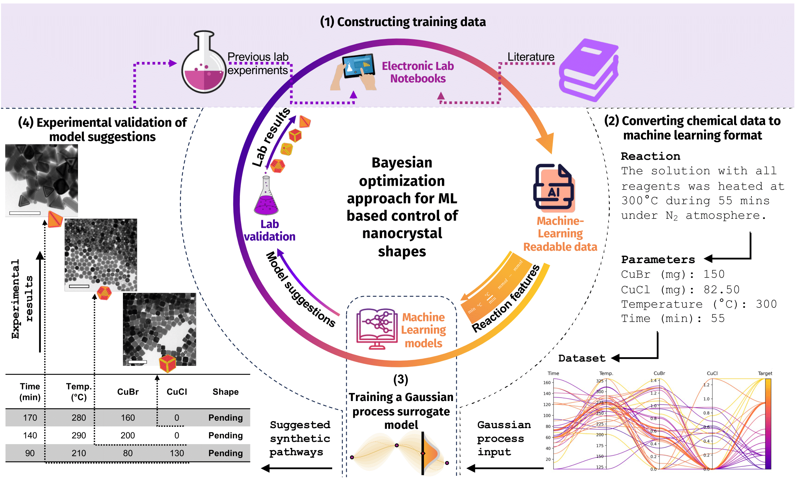
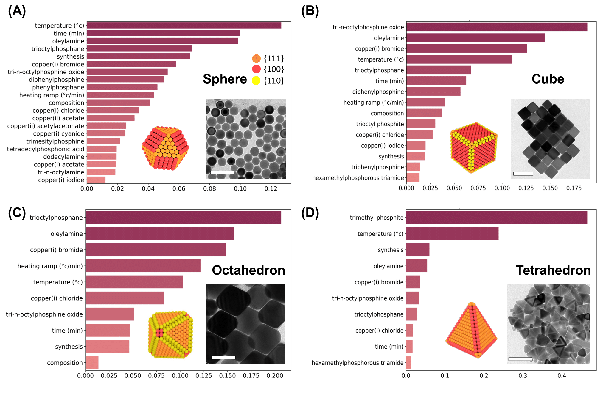
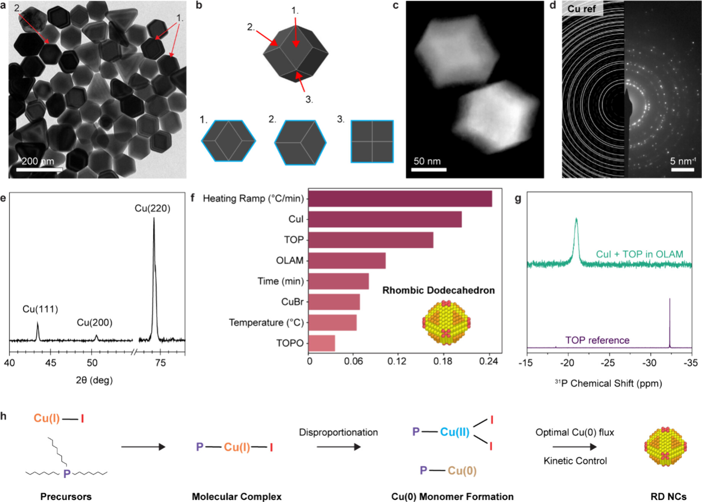

<!--
<p align="center">
  
</p>
-->
<!--
<h1 align="center">
  
</h1>

<p align="center">
    <a href="https://github.com/schwallergroup/boludo/actions/workflows/tests.yml">
        
    </a>
    <a href="https://pypi.org/project/boludo">
        
    </a>
    <a href="https://pypi.org/project/boludo">
        
    </a>
    <a href="https://github.com/schwallergroup/boludo/blob/main/LICENSE">
        
    </a>
    <a href='https://boludo.readthedocs.io/en/latest/?badge=latest'>
        
    </a>
    <a href="https://codecov.io/gh/schwallergroup/boludo/branch/main">
        
    </a>  
    <a href="https://github.com/cthoyt/cookiecutter-python-package">
         
    </a>
    <a href='https://github.com/psf/black'>
        
    </a>
    <a href="https://github.com/schwallergroup/boludo/blob/main/.github/CODE_OF_CONDUCT.md">
        
    </a>
</p>
-->
<h1 align="center">
  BOLUDO 🔮
</h1>

<p align="center">
Code accompanying the paper <a href="https://pubs.acs.org/doi/10.1021/jacs.4c17283">A Holistic Data-Driven Approach to Synthesis Predictions of Colloidal Nanocrystal Shapes</a>
</p>

<p align="center">
<i>Bayesian Optimization for nanocrystaL strUcture Design Optimization</i><br>
<small>But really, it's the work of <b>Bo</b>jana Ranković and <b>Ludo</b>vic Zaza, under the supervision of Prof. Raffaella Buonsanti and Prof. Philippe Schwaller, bringing Bayesian optimization into the chemistry lab and discovering new nanocrystal morphologies! 🚀</small>

<small>Also, we fully acknowledge the meaning of "boludo" in Argentine Spanish slang - turns out even crystals can be shaped by a couple of friendly boludos. 😂</small>
</p>


## 🎯 Overview

<p align="center">
  
  <br>
  <em>Figure 1: Complete workflow showing ELN integration, BO model fitting, and experimental validation</em>
</p>

BOLUDO is a machine learning framework that revolutionizes nanocrystal synthesis by:
- Predicting nanocrystal shapes from reaction conditions
- Suggesting optimal reaction parameters for target shapes
- Operating effectively with limited data (<200 experimental points)
- Enabling discovery of new nanocrystal shapes through continuous energy scale mapping


## ✨ Model Architecture

The system consists of three main components:

1. **Data Processing Pipeline**
   - ELN data extraction
   - Feature engineering
   - Synthesis parameter standardization

2. **Machine Learning Models**
   - Random Forest for interpretable predictions
   - Gaussian Process for Bayesian optimization
   - Surface energy scale mapping

3. **Optimization Framework**
   - Bayesian optimization for parameter space exploration
   - Multi-objective optimization capabilities
   - Uncertainty quantification

<p align="center">
  
  <br>
  <em>Figure 2: Visualization of parameter importance in nanocrystal shape prediction</em>
</p>


<!-- ## 💪 Getting Started

> TODO show in a very small amount of space the **MOST** useful thing your package can do.
> Make it as short as possible! You have an entire set of docs for later. -->

<!-- ### Command Line Interface

The boludo command line tool is automatically installed. It can
be used from the shell with the `--help` flag to show all subcommands:

```shell
$ boludo --help
``` -->

<!-- > TODO show the most useful thing the CLI does! The CLI will have documentation auto-generated
> by `sphinx`. -->


## 🏆 Results

Our framework has achieved significant breakthroughs:
- Successfully predicted synthesis conditions for various Cu nanocrystal shapes and vice versa
- Discovered <b style="color: maroon;"> novel synthesis pathways</b>
- Achieved <b style="color: maroon;">first-time synthesis</b> of <b style="color: maroon;">Cu rhombic dodecahedron</b> shape
- Demonstrated effectiveness with only <b>115 initial data points</b>

<p align="center">
  
  <br>
  <em>Figure 1: Complete workflow showing ELN integration, BO model fitting, and experimental validation</em>
</p>

## 🚀 Installation

<!-- Uncomment this section after your first ``tox -e finish``
The most recent release can be installed from
[PyPI](https://pypi.org/project/boludo/) with:

```shell
$ pip install boludo
```
-->

The most recent code and data can be installed directly from GitHub with:

```bash
$ pip install git+https://github.com/schwallergroup/boludo.git
```

## 📚 Citation

```bibtex
@article{zaza2024holistic,
  title={A Holistic Data-Driven Approach to Synthesis Predictions of Colloidal Nanocrystal Shapes},
  author={Zaza, Ludovic and Rankovic, Bojana and Schwaller, Philippe and Buonsanti, Raffaella},
  journal={Journal of the American Chemical Society},
  year={2024},
  doi={10.1021/jacs.4c17283}
}
```


## 💰 Acknowledgments

This work was supported by NCCR Catalysis, a National Centre of Competence in Research funded by the Swiss National Science Foundation (grant number 180544).

## 👐 Contributing

Contributions, whether filing an issue, making a pull request, or forking, are appreciated. See
[CONTRIBUTING.md](https://github.com/schwallergroup/boludo/blob/master/.github/CONTRIBUTING.md) for more information on getting involved.

## 👋 Attribution

### ⚖️ License

The code in this package is licensed under the MIT License.


<!--
### 🎁 Support

This project has been supported by the following organizations (in alphabetical order):

- [Harvard Program in Therapeutic Science - Laboratory of Systems Pharmacology](https://hits.harvard.edu/the-program/laboratory-of-systems-pharmacology/)

-->

<!--
### 💰 Funding

This project has been supported by the following grants:

| Funding Body                                             | Program                                                                                                                       | Grant           |
|----------------------------------------------------------|-------------------------------------------------------------------------------------------------------------------------------|-----------------|
| DARPA                                                    | [Automating Scientific Knowledge Extraction (ASKE)](https://www.darpa.mil/program/automating-scientific-knowledge-extraction) | HR00111990009   |
-->

### 🍪 Cookiecutter

This package was created with [@audreyfeldroy](https://github.com/audreyfeldroy)'s
[cookiecutter](https://github.com/cookiecutter/cookiecutter) package using [@cthoyt](https://github.com/cthoyt)'s
[cookiecutter-snekpack](https://github.com/cthoyt/cookiecutter-snekpack) template.

## 🛠️ For Developers

<details>
  <summary>See developer instructions</summary>

The final section of the README is for if you want to get involved by making a code contribution.

### Development Installation

To install in development mode, use the following:

```bash
$ git clone git+https://github.com/schwallergroup/boludo.git
$ cd boludo
$ pip install -e .
```

### 🥼 Testing

After cloning the repository and installing `tox` with `pip install tox`, the unit tests in the `tests/` folder can be
run reproducibly with:

```shell
$ tox
```

Additionally, these tests are automatically re-run with each commit in a [GitHub Action](https://github.com/schwallergroup/boludo/actions?query=workflow%3ATests).

### 📖 Building the Documentation

The documentation can be built locally using the following:

```shell
$ git clone git+https://github.com/schwallergroup/boludo.git
$ cd boludo
$ tox -e docs
$ open docs/build/html/index.html
``` 

The documentation automatically installs the package as well as the `docs`
extra specified in the [`setup.cfg`](setup.cfg). `sphinx` plugins
like `texext` can be added there. Additionally, they need to be added to the
`extensions` list in [`docs/source/conf.py`](docs/source/conf.py).

### 📦 Making a Release

After installing the package in development mode and installing
`tox` with `pip install tox`, the commands for making a new release are contained within the `finish` environment
in `tox.ini`. Run the following from the shell:

```shell
$ tox -e finish
```

This script does the following:

1. Uses [Bump2Version](https://github.com/c4urself/bump2version) to switch the version number in the `setup.cfg`,
   `src/boludo/version.py`, and [`docs/source/conf.py`](docs/source/conf.py) to not have the `-dev` suffix
2. Packages the code in both a tar archive and a wheel using [`build`](https://github.com/pypa/build)
3. Uploads to PyPI using [`twine`](https://github.com/pypa/twine). Be sure to have a `.pypirc` file configured to avoid the need for manual input at this
   step
4. Push to GitHub. You'll need to make a release going with the commit where the version was bumped.
5. Bump the version to the next patch. If you made big changes and want to bump the version by minor, you can
   use `tox -e bumpversion -- minor` after.
</details>
